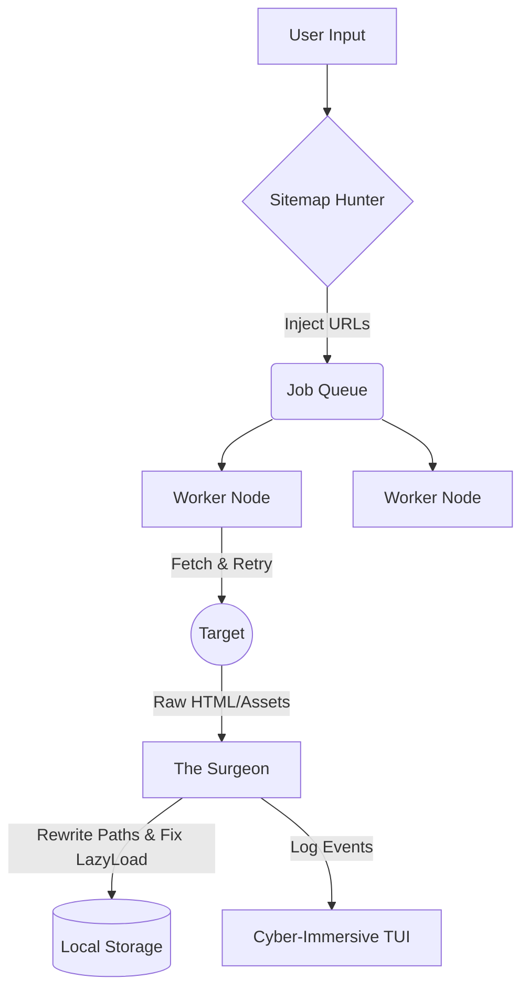

# 🧬 IKELOS - THE REALITY SHIFTER

> **The Omniscient Web Cloner.**
> *Absorb. Replicate. Dominate.*


---

## 📖 Overview

**IKELOS** is not just a web scraper; it is a **Tactical Reality Shifting Engine**.

Named after the Greek god of realistic dreams, Ikelos creates perfect, offline-browsable mirrors of any target website. Built on a high-performance concurrent Golang architecture, it bypasses modern protections (Lazy Loading, WAFs) to deliver pixel-perfect replicas.

Unlike traditional tools like `wget` or `HTTrack`, Ikelos features a cinematic **"Cyber-Immersive" TUI** (Terminal User Interface) that visualizes the data ingestion process in real-time.

### ✨ OMNISCIENT Features (v6.0.0)

* **🕷️ Sitemap Hunter (NEW):** Automatically detects and parses `sitemap.xml` and `robots.txt` to discover hidden pages not linked on the homepage.
* **⚡ The Swarm Engine:** A massive concurrent downloader capable of saturating bandwidth with hundreds of micro-threads.
* **🛡️ WAF Evasion:** Built-in **Retry Logic** with exponential backoff and **User-Agent Rotation** to mimic human behavior and bypass firewalls.
* **👁️ Lazy-Load Killer:** Detects and forces the download of hidden assets (`data-src`, `srcset`), ensuring no broken images or "grey squares".
* **💉 The Surgeon:** Rewrites HTML/CSS paths on-the-fly for a seamless offline experience (Relative Path Injection).
* **🎨 Dynamic Themes:**
    * 🔵 **MIRROR:** Cyberpunk Cyan/Blue (High Fidelity).
    * 🔴 **BLITZ:** Aggressive Neon Red (Max Speed).
    * ⚪ **SHADOW:** Monochrome Stealth (Low Profile).

---

## ⚡ Installation

### Prerequisites
* **Go 1.21** or higher installed.
* A terminal with **TrueColor** support.

### Fast Install (Makefile)

```bash
# 1. Clone the repository
git clone [https://github.com/StaiLee/Ikelos.git](https://github.com/StaiLee/Ikelos.git)
cd Ikelos

# 2. Install dependencies & Compile
make

# 3. Install globally (Optional)
make install
```

### Manual Build

```bash
go mod tidy
go build -ldflags="-s -w" -o ikelos main.go
```

---

## 🚀 Usage

Ikelos simplifies complex mirroring tasks into 3 tactical modes.

```bash
ikelos -url <TARGET> [FLAGS]
```

### 🛡️ Tactical Modes

| Mode | Code | Description | Best Use Case |
| :--- | :--- | :--- | :--- |
| **MIRROR** | `-mode mirror` | **(Default)** High fidelity. Balanced recursion and speed. | UI/UX Theft, Offline Backup. |
| **SHADOW** | `-mode shadow` | **Stealth / Evasion.** Slow, randomized jitter, human emulation. | Protected Sites (Cloudflare), WAFs. |
| **BLITZ** | `-mode blitz` | **Aggressive Dump.** Max threads, minimal timeouts. | Data Hoarding, CTFs, Docs scraping. |

### 🚩 Command Flags

| Flag | Description |
| :--- | :--- |
| `-url` | The target website (e.g., `https://example.com`). |
| `-out` | Output directory for the clone (Default: `./cloned_site`). |
| `-depth` | Recursion depth. `2` is standard. `0` = Infinite (Danger). |
| `-threads` | Number of concurrent workers (Default: `20`). |
| `-nositemap` | Disable the *Sitemap Hunter* module (Strict crawling). |

### 💡 Operational Examples

**1. The Perfect Clone (Design Theft)**
Create a pixel-perfect replica of a landing page for analysis.
```bash
ikelos -url [https://awwwards.com](https://awwwards.com) -mode mirror
```

**2. The Stealth Extraction (Protected Site)**
Clone a site behind basic protection using randomized delays.
```bash
ikelos -url [https://protected-site.com](https://protected-site.com) -mode shadow
```

**3. The Data Dump (Documentation)**
Download an entire documentation site with high concurrency.
```bash
ikelos -url [https://docs.python.org](https://docs.python.org) -mode blitz -depth 3 -threads 50
```

---

## 🏗️ Technical Architecture

Ikelos is an engineering lesson in **Go Concurrency** and **HTML Surgery**:

1.  **The Hunter:** Scans `robots.txt` and `sitemap.xml` to build an initial target map.
2.  **The Brain (Crawler):** Manages a thread-safe `Visited` map to avoid loops and distributes jobs.
3.  **The Swarm (Workers):** Hundreds of Goroutines fetch assets simultaneously.
4.  **The Surgeon (Parser):** Uses `goquery` to parse DOM, inject local paths, and decrypt `srcset` attributes.
5.  **The UI (Bubble Tea):** A separate event loop renders the dashboard at 60fps without blocking the engine.



---

## ⚠️ Disclaimer

**Ikelos is intended for educational purposes, digital archiving, and authorized security testing.**
Cloning websites you do not own may violate terms of service or copyright laws. The developers assume no liability for misuse.

---

## 📜 License

Distributed under the MIT License. See `LICENSE` for more information.